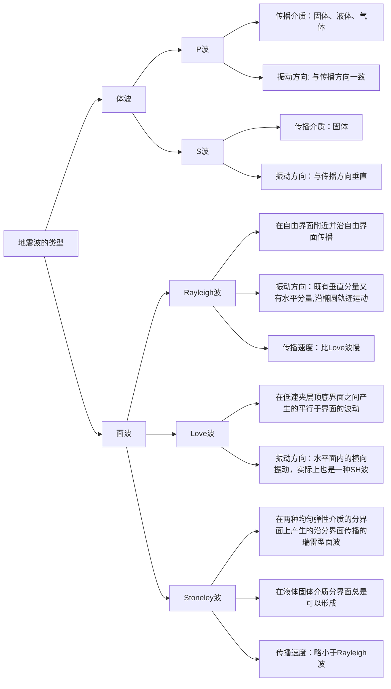
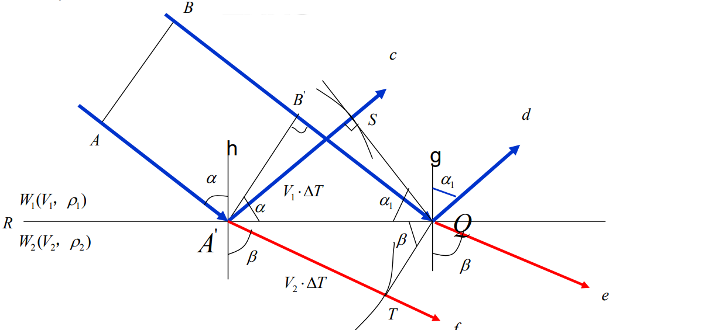

# 地震勘探

## 地震波的基本类型及传播等

### 地震波的基本类型

有关这一问题的回答的逻辑参考下面这个思维导图

文字版回答：  

1. **体波**：  
    从**弹性波场**知道，在**外力作用**下，**弹性介质**中存在着两种扰动（**涨缩力和旋转力**）。由于涨缩力的扰动，弹性介质产生**体积应变**，体积应变产生的波动称为纵波（P波）；由于旋转力的扰动，弹性介质产生**剪切应变**，剪切应变所引起的波动称为横波（S波）。这两种波动统称为**体波**。  

    - **纵波的特点**：
        1. 纵波在介质中传播时，波的传播方向与质点振动**方向一致**，因此又称为线性极化波；
        2. 纵波的传播速度 $V_p = \sqrt{\frac{\lambda + 2 \mu}{\rho}}$；
        3. **振动的强度**随着传播距离的增大而减弱。

    - **横波的特点**：
        1. 横波在介质中传播时，波的传播方向与质点的振动方向**垂直**；
        2. 质点振动在水平平面中的横波分量称为**SH波**，在垂直平面中的横波分量称为**SV波**；
        3. 横波的传播速度 $V_s = \sqrt{\frac{\mu}{\rho}}$；
        4. 在液体和气体中，由于**剪切模量** $\mu = 0$，故不存在横波。

2. **面波**：

    相对于体波而言，在**弹性分界面**附近还存在着另一类扰动。从**能量**上来说，它们只会分布在弹性分界面附近，故称为面波。面波又会分为瑞雷面波、勒夫面波、斯通利波。

    - 三种面波：
        - **瑞雷面波**：**质点振动轨迹**沿波传播方向成**逆时针方向**的椭圆轨迹运动。只分布于自由界面附近并沿自由界面传播，随据表面距离的增加增幅呈现指数衰减
        - **勒夫面波**：质点在**水平方向振动**并垂直于波的传播方向。是一种在低速夹层顶底界面之间产生的平行于界面的波动
        - **斯通利波**：在**两种均匀弹性介质的分界面**上形成的**类似于瑞雷型**的面波。沿着固-液边界传播，或者在特定条件下也沿着固-固边界传播。斯通利波的振幅在两种接触介质之间的边界处具有最大值，并在远离接触介质时呈指数衰减

        - 面波特点：
            1. 速度低，面波速度一般**略低于**横波速度；
            2. 能量强，在**远离震源时**，面波能量往往**强于体波能量**；
            3. 瑞雷面波振动能量沿垂直方向衰减快，而沿水平方向衰减慢；
            4. 频率低，面波主频一般在 $10\sim 20 Hz$；
            5. 存在频散现象，即波速是频率的函数。
        !!! tip
    面波的特点可以简单记为低频低速强振幅会频散  
    叙述面波的分类时，可以按照对应质点的运动规律+这类面波存在的条件这样的逻辑记忆

### 地震波的传播
!!! note 
    地震波的传播是一个非常丰富的话题，下面对可能考到的话题进行逐一阐述做一布防，复习时以理解为主，考试时按照对应的内容填写  
    如果只是宽泛的问地震波的传播：可以按照地震波传播的理论基础（3点）+ 运动学动力学（3点）+ 地质因素（5点）回答

- 地震波传播的理论基础 
    - 惠更斯定律：在弹性介质中，已知t时刻的同一波前面上的各点，可以把这些点看作从此时刻产生子波的新的点振源，由它产生二次扰动，经过$\Delta t$时间后，这些子波的包络面就是$t+\Delta t$时刻新的波前面
    - 惠更斯-菲涅耳原理：由波前面上各点所产生的子波，在观测点上相互干涉叠加，其叠加结果就是我们在该点观测到的总扰动。
    - 费马原理： 波沿走时最短的路径传播
    - 视速度定理： 在射线方向观测波的传播速度，就是波在介质中传播的真速度，但是地震勘探往往是在地面观测，观测到的速度小于真速度，称之为视速度。$V_a = V / sin \alpha$,$\alpha$是射线与地面法线的夹角  
    😡以上内容是地震波传播的理论基础 
- 地震波传播的动力学与运动学
    - 运动学特征：包括反射、透射、折射 、绕射。
    
    如图所示，c为反射，d为折射，地震波里的折射多了一段滑行波的概念，就是传播到界面会沿界面滑行一段距离再折射上去  
    !!! warning  
        事已至此，不再赘述反射，折射透射的概念，仅作几点说明   

        - 下界面速度大于上界面才会出现折射  
        - snell 定律：$\frac{V_1}{sin \alpha} = \frac{V_1}{sin \alpha_1} = \frac{V_2}{sin \beta}$ 
        - 绕射：地震波传播经过物性不连续点的时候，可以把不间断点看作震源，由这个新震源产生的扰动向四周传播，这种现象称为绕射。
    
    - 动力学特征：包括波在弹性分界面上的波形转换和能量分配
    弹性波入射弹性分界面的时候会出现波形的转换，入射纵波可能会形成反射纵波、反射横波、透射纵波和透射横波。波形相同称之为同类波，不同称之为转换波。
    能量分配遵循佐普利兹方程（弹性分界面上各种波的振幅关系）

    - 地震波传播时会产生能量衰减，主要包括：波前扩散、吸收衰减、 透射损失
- 影响地震波传播的地质因素
    1. **密度**：  
        不同岩石具有不同密度，其波速也不同。通常**密度大的致密岩石波速较大**。
    2. **孔隙度**：  
        一般波在**流体中的速度小于骨架速度**，因此孔隙度大的岩石波速较小。而且孔隙度的变化也会影响密度的变化，**孔隙度增大，岩石密度相对减小**。
    3. **孔隙填充物**：    
        岩石孔隙中的填充物不同也会引起波速变化，$v_{气} < v_{油} < v_{水}$。
    4. **风化程度**：  
        风化作用使岩体矿物变异，原生结构破坏，导致质点间弹性联系减弱。**岩体波速随风化程度的增大而减小**。
    5. **其他因素**:  
        一般年代越久，埋藏越深，上覆地层压力时间越长，强度越大，孔隙度变小，密度变大，波速变大。

## 地震波时距关系
包括反射波和折射波时距方程和时距曲线，均方根速度、射线速度、平均速度等

- 均方根速度：把**水平层状介质**情况下的**反射波时距曲线近似地看成双曲线**时，求出的波速就是这一水平层状介质的均方根速度。 (层速度平方按照各层走时加权平均再取根号)

$$v_\sigma = \sqrt{\frac{\sum_{i= 1}^{n}t_i v_i^2}{\sum_{i= 1}^{n}t_i}}$$

- 射线速度：波按照射线传播的速度(总路程除以总时间)  

$$ v_r = \frac{\sum_{i=1}^{n}\frac{h_i}{cos \alpha_i}}{\sum_{i=1}^{n}\frac{h_i}{v_i cos \alpha_i}}$$

- 平均速度：地震波垂直穿过地层的总厚度与单程传播所需的总时间之比

$$ \bar v = \frac{\sum_{i = 1}^n h_i}{\sum_{i = 1}^n t_i}$$

上图展示了三种速度的关系， 

- 当x = 0时,$v_r = \bar v$，随着x的增加，$v_r$将大于$\bar v$趋近$v_\sigma$,   
- 当x = h时，$v_r = v_\sigma$，
- 之后$v_r$不断趋近介质最高层速度，$v_\sigma$的误差也不断增加

## 地震勘探的野外数据采集
包括地震仪器的原理，地震勘探观测系统，地震波速测定等

## 地震勘探抗干扰技术
包括地震组合检波法、多次覆盖技术，地震勘探分辨率及抗干扰技术等