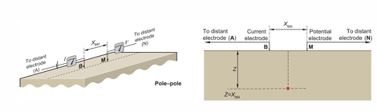
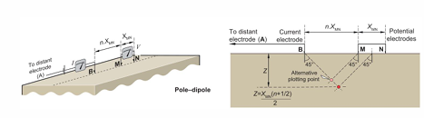
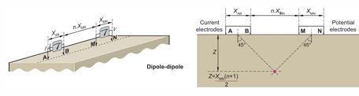
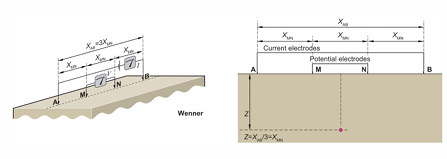
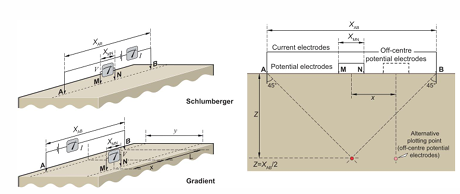
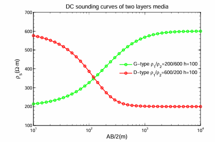
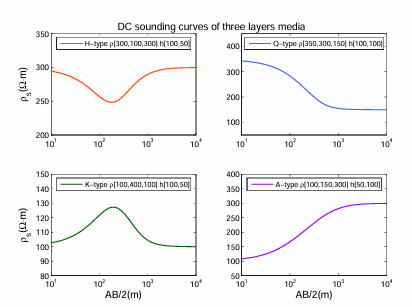

# 电（磁）法勘探

## 天然地电场与人工地电场的特性
地电场平静变化和干扰变化特征；稳定电流场的基本性质、稳定电流场的求解、均匀大地电阻率的测量

!!! note 
    可以按照 定义 特点 原因 变化 两者区别来写
1. **天然地电场**：

    具有全球性或区域性的变化天然电场称为**大地电场**；地方性的天然稳定电场称为局部电场，又称为**自然电场**。

    1. **大地电场**：

        大地电场是**各种天电在地壳和地球内部产生的感应电场**，与地球变化磁场密不可分，具有相同的场源。大地电场按照时变形态可以分为两大类：地电场的平静变化和地电场的干扰变化。

        1. **平静变化**：
            地电场的平静变化具有连续性和周期性，可分为太阳活动变化、年变化、日变化、月变化和静日地电日变化。
        2. **干扰变化**：
            干扰变化可以分为高频地电变化、地电脉动、地电湾扰、扰日地电日变化和地电暴。

    2. **自然电场**：
    
        自然电场是由**局部物理化学条件不同形成的天然局部性电场**。
        
        按成因分为**氧化还原电场**、**过滤电场**和**扩散电场**。过滤电场又称渗流电场，按渗流机制可分为裂隙电场、长升泉电场、山地电场和河流电场。自然电场也有人工电场成分，即由人类生活或生产活动中的电器设备及附件产生的游散电流形成的电场，在电法勘探中通常称为游散电场。
    
    **特性**：

    - **时间变化**：通常表现为低频变化（如地磁暴时），也可能有高频信号（如雷电活动）。
    - **分布广泛**：天然地电场在全球范围内存在，与地球介质结构相关。
    - **受环境影响大**：天气、太阳活动等会对天然地电场的强度和频谱产生显著影响。
    - **探测深度大**：由于波长长，天然地电场信号可以穿透深层地壳甚至地幔。

2. **人工地电场**：

    人工建立的电场是**为某种探测目的而由人工源激发的直流电场和交流电场**。

    人工电场可分为通过接地建立的稳定的**直流电场**和**时变电场**或**交变电磁场**。交变电磁场按场的激励方式不同又可分为由接地电极产生的电偶极子场、不接地回线产生的磁偶极场和长供电导线产生的电磁场。

    **特性**：

    1. **可控性**：
        - 人工电场的频率、强度和极性可以根据需要调节。
    2. **空间局限性**：
        - 电场集中在电极附近，远距离处信号强度迅速衰减。
    3. **噪声较低**：
        - 因为是人为产生的，可以通过信号处理减小外界干扰。
    4. **探测深度有限**：
        - 由于高频率信号衰减快，通常用于中浅层勘探。

> ⚠️ 对于一道简答题，上面的字儿可能有点多了，建议只写黑体字和对应的特性。下面是一个对照的表格。
 
| **特性** | **天然地电场** | **人工地电场** |
|:-------:|:-------------:|:------------:|
| **来源** |自然过程（如地磁感应、大气电场等|人为施加电流|
| **频率范围** |较低频| 可控  |
| **分布范围** | 全球范围 | 局部范围 |
| **探测深度** | 深层（地壳到地幔）| 浅层到中深层（视电场频率而定）|
| **应用** | 深层结构探测，如大地电磁法（MT）| 矿产、水资源和环境勘探|
| **受干扰性** | 受天气和太阳活动等干扰影响较大| 干扰较小，信噪比可控|

##  （视）电阻率、（视）极化率的基本概念及观测方法  

视电阻率、视极化率的内涵、剖面观测方法及电极排列方式、直流电阻率测深方法及曲线类型；电阻率影响因素（成分、结构、孔隙度与湿度、温度、压力、频率等）、极化率的影响因素（充放电时间，矿分成分、含量、结构及含水性）

- **视电阻率**
假设地面是水平无限大，地下是均匀各向同性介质，在地面AB两点供电，MN测量电压，则地下均匀各向同性介质的电阻率可以按下式计算

$$\rho  = K \cdot \dfrac{\Delta U_{MN}}{I}$$

上式中K为装置系数，定义如下

$$K = 2\pi \cdot \dfrac{1}{\frac{1}{AM}-\frac{1}{AN}-\frac{1}{BM}+\frac{1}{BN}}$$

上式的使用条件为地面水平且无限大，地下是均匀无限大各向同性介质。实际情况并不符合，地形常常是起伏不平的，地下介质也常常是不均匀的，这是我们仍然使用上式计算的结果得到一个电阻率值，这个电阻率就称为视电阻率，是地下电性不均匀和地形的一种综合反映，因此可以利用它的变化规律发现和了解地下的不均匀性，以达到找矿和解决其他地质问题的目的

- **视极化率**

极化率是表征岩石和矿石激发极化效应的强弱的基本参数
是直流激发极化的一种基本测量参数。当地下有两种以上不同极化率的矿石或者岩体时，用某一电极测量方式得到的极化率是地下各极化体的激发极化效应的综合体现，我们称之为视极化率

$$ \eta_s = \dfrac{\Delta U_2}{\Delta U}$$

式中 $\Delta U$为一次场+二次场的总异常, $\Delta U_2$为二次场电位差

!!! note 
    可以记为二次场/总场，视极化率只在时间域使用，频率域的说法是视幅频域

- 观测方式   

有单极-单极，三极，对称四极等方式，注意温纳装置是$AM = MN =NB$

    
    
    
    

-  区分剖面观测方式与测深观测方式

剖面观测方式是保持电极之间的相对距离，不停移动电极组，这样得到的视电阻率剖面是一定深度内地电断面的综合反映
测深是在同一个测点上不断扩大电极距，使探测深度不断加深，可以得到观测点处由浅到深的视电阻率变化情况

测深曲线主要分二层和三层

- 影响电阻率的因素

    1. 成分和结构 胶结物和矿物颗粒的电阻率、形况以及含量决定岩石电阻率，层理方向电阻率小于垂直层理方向的电阻率
    2. 湿度 含水量大的岩石电阻率低
    3. 温度 温度越高，电子导体矿物电阻率越高，离子矿物电阻率越低
    4. 压力 压力极限内 压力越大，电阻率越高，超出极限后，电阻率下降
    5. 孔隙度 孔隙度越大含水量越高电阻率越低

- 影响极化率的因素

    1. 充放电时间
    2. 岩矿石的成分以及含量 主要取决于电子导体矿物的体积百分含量以及结构
    3. 电子导体矿物的颗粒度 颗粒度越小 极化率越大
    4. 电子导体矿物的形状和排列方向 沿矿物颗粒延申方向极化率最大
    5. 致密程度越大，极化率越大
    6. 地层水的矿化度 地层水的矿化性较低时，电阻率较高，激发极化效应随着矿化度的升高而增加；随着矿化度升高，地层水的电阻率降低，激发极化效应降低

!!! 补充一点激发极化法的优点
    可以区分离子导体和电子导体引起的电性异常；可以寻找电子导体密集的浸染状矿床；纯地形、浮土等对极化率影响小，只有极化体存在时对异常有影响

