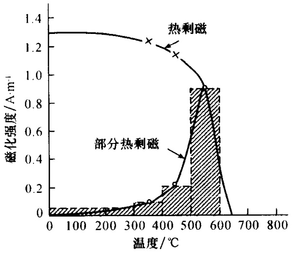

# 磁法勘探

## 正常地磁场和磁异常相关概念及物理意义

按研究地磁场的目的不同，可将地磁场分为正常地磁场（正常场）和磁异常（异常场）两部分。在地磁学研究中，有确定的正常地磁场和明确含义的磁异常的概念。通常情况下，正常场和异常场是相对的概念，正常磁场可以认为是磁异常（即所要研究的磁场）的背景场或基准场。如研究大陆磁异常，则将中心偶极子场作为正常地磁场；研究地壳磁场时，以中心偶极子场和大陆磁场之和为其正常场，可见正常场的选择是根据所研究磁异常的要求而确定的。  

磁力勘探在地质工作中的应用，因解决各种地质问题的对象不同、测区大小不同以及由于对不同深度场源性质的研究，关于正常磁场的选取也是相对的。例如，在弱磁性或非磁性地层中要圈定强磁性岩体或矿体，通常将前者所引起的磁场作为正常背景场，而后者产生的磁场为磁异常；有时要在磁性岩层中圈定非磁性地层，这时可把磁性岩层的磁场作为正常场，而非磁性地层中的磁场相对变化为异常场。总之，以止常背景场作为基准场，有效地提取所要研究对象的磁场变化，进一步研究其异常场与所要解决的各种地质问题的对应关系，这是磁法勘探中解释磁异常的一项重要任务。  

由于磁异常是一个矢量场 $\pmb{T_{\mathrm{a}}}$ ，若直接测量 $\pmb{T_{\mathrm{a}}}$ 的大小和方向是比较困难的。实际工作中常测量 $\pmb{T}_{\mathfrak{a}}$ 的分量，如垂直分量 $\pmb{Z_{a}}$ 、水平分量 $\pmb{H}_{\mathfrak{a}}$ 以及地磁场总强度的模量差 $\Delta T$ ，分别称为垂直磁异常、水平磁异常和总强度磁异常。为要测出异常值，一般采用相对测量和绝对测量两种办法。相对测量只需测出测点磁场值对于正常场中某一固定点上磁场的相对值即可。绝对测量则测出磁场各点的实际值，再以测点值与正常场中某-固定点（基点）上的绝对值相减得到异常值。因此磁异常 $Z_{a}$ 、 $H_{\mathbf{ax}}$ 、 $H_{\mathbf{ay}}$ 和 $\Delta T$ 可分别表示为  

$$
Z_a=Z - Z_0 \,\;\;\;\;\;\;\;\;\;\; H_{ax} = H_x - H_{0x} 
$$  

$$
H_{ay} = H_y - H_{0y} \,\;\;\;\;\;\;\;\;\;\; \Delta T = T - T_0
$$  

其中 $Z_{0}$ 、 $H_{0x}$ 、 $H_{0y}$ 、 $T_{0}$ 为正常场中基点上的磁场值； $T_{0}$ 为 $Z_{0}$ 、 $H_{0x}$ 、 $H_{0y}$ 点分量的合成模量；而 $Z$、$H_{x}$、$H_{y}$ 为相应测点上的磁场值， $\pmb{T}$ 为 $Z$、$H_{x}$、$H_{y}$ 三分量的合成模量。 $\Delta T$ 是 $\pmb{T}$ 和 $\pmb{T}_{0}$ 的模量差，而 $\pmb{T}_{\pmb{a}}$ 是 $\pmb{T}$ 和 $\pmb{T}_{0}$ 的矢量差，特别应注意 $\Delta T$ 与 $\pmb{T_{\mathrm{a}}}$ 是不同的。不同的磁异常参量有不同的磁场特征，因此对磁异常要研究多参量解释方法。  

## 视磁化率、真磁化率和消磁/退磁作用的概念、区别及联系

1. **视磁化率、真磁化率**：
    - **真磁化率**：
    岩石标本的**真正磁化率**，**不包含退磁作用**的影响。
    - **视磁化率**：
    没有进行**退磁改正**的磁化率，视磁化率永远**小于等于**真磁化率。

    对于**磁化率计算**来讲，如果**矿物组分**的磁化率是真磁化率，则计算得到的磁化率就是真磁化率。反之，得到的就是视磁化率。

2. **退磁/消磁**：

    当**地质体**被外磁场磁化时，在其内部除存在外磁场外，还能产生一个与外磁场方向相反的磁场，抵消一部分外磁场，这一现场称为消磁作用，又称“退磁作用”。

    **有限物体**受外磁场磁化时，由于**受到物体退磁作用的影响**，测量得到的磁化率往往比物体真正的磁化率要小。
    
    设真磁化率为 $K$，得到的磁化率为 $K'$，则有

    $$
    K' = \frac{K}{1 + N \cdot K}
    $$

    其中 $N$ 为**消磁系数**，它随**物体形状**的不同和**磁化方向**的不同而变化。

    $K'$ 即为视磁化率，在**磁异常计算**中，有时也称**反演计算**的磁化率为视磁化率。

## 岩石剩余磁性的成因及作用

### 剩余磁性的成因
由于形成剩余磁性的磁化历史（如磁化场、矿物成分、温度及化学反应等）的不同，因而剩余磁性的类型、特点不相同。  

#### 热剩余磁性（TRM）  
在恒定磁场作用下，岩石从居里点以上的温度，逐渐冷却到居里点以下，在通过居里温度时受磁化所获得的剩磁，称热剩余磁性（又称温度顽磁性，简称热剩磁）。  
应当提到，热剩磁并非全都在居里温度时产生的。如令岩石自居里点逐渐冷却至室温，且只在某一温度区间施以外磁场，由此得到的热剩余磁性，称部分热剩磁，如下图所示 。  
热剩磁的特点如下。  
1. 它的强度大。在弱磁场中，其热剩磁强度大致正比于外磁场强度，并同外磁场方向一致。因此，火成岩的大然剩余磁化强度方向，一般代表了成岩时的地磁场方向。  
2. 热剩磁具有很高的稳定性。剩磁随时间衰减的现象，叫做磁性弛豫。热剩磁的稳定，表现为其弛豫时间很长。实验表明，外磁场的变化，温度在 $200\sim300^{\circ}\mathrm{C}$ 内的热作用，很难影响热剩磁的变化。  
3. 实验证明，总热剩磁是居里温度至 室温，各个温度区间的部分热剩磁之和。即热剩磁服从叠加定律（特里埃第一定律）。  
4. 若将已具有热剩磁 $M_{\mathfrak{n}}$ 的岩石标本， 在零磁场空间内从室温加热到某一个温度 $T_{\mathfrak{l}}$ ，然后再冷却至室温，则标本中 $T_{\mathfrak{l}}$ 温度以下的部分热剩磁全被清洗掉，称部分热退磁（或热清洗）。此过程可通过不断提高加热温度来重复进行，最终得到一个热剩余磁化强度。说明热退磁过程亦服从叠加定律（特里埃第二定律）。因此，岩石的热剩磁是古地磁研究的主要对象之一。  

#### 碎屑剩余磁性（DRM）  

沉积岩中含有从母岩风化剥蚀带来的许多碎屑颗粒，具中磁性颗粒（磁铁矿等）在水中沉积时，受当时的地磁场作用，使其沿地磁场方向定向排列，或者是这些磁性颗粒在沉积物的含水孔隙中转向地磁场方向。沉积物固结成岩后，按具碎屑的磁化方向保仔下米的磁性，称碎屑剩余磁性（沉积剩余磁性，简称碎屑剩磁）。  

碎屑剩磁的特点：  
1. 它的强度正比于定向排列的磁性颗粒数目。其强度比热剩磁小得多。 
2. 形成碎屑剩磁的磁性颗粒大都来自火成岩，这些颗粒的原生磁性米自热剩磁。因此碎屑剩磁比较稳定。 
3. 等轴状颗粒，其碎屑剩磁方向和外磁场（地磁场）万向-一致。  

#### 化学剩余磁性（CRM）  

在一定磁场中，某些磁性物质在低于居里温度的条件下，经过相变过程（重结晶）或化学过程（氧化还原），所获得的剩磁，称化学剩余磁性（简称化学剩磁）。  

化学剩磁的特点： 
1. 在弱磁场中，其剩磁强度止比于外磁场的强度。
2. 化学剩磁有牧高的稳定性。 
3. 在相同磁场中，化学剩磁强度只有热剩磁强度的儿十分之一；但它大于碎屑剩磁强度。  

上述三种剩余磁性，又称为原生剩磁。  

####  粘滞剩余磁性（VRM）  

岩石生成之后，长期处在地球磁场作用下，随着时间的推移，其中原来定向排列的磁畴，逐渐地弛豫到作用磁场的方向，所形成的剩磁称粘滞剩余磁性。  

粘滞剩余磁性的特点： 
1. 它的强度与时间的对数成止比。 
2. 随温度增高，粘滞剩磁增大。裸露干地表的岩石，受昼夜及季节的温差变化的热骚动影响，随时间增长，会形成牧强的粘滞剩磁。具有较大粘滞剩磁的岩石样品，不宜用于古地磁研究。  

#### 等温剩余磁性（IRM）  

在常温没有加热情况下，岩石因受外部磁场的作用（比如闪电作用），获得的剩磁称等温剩余磁性。  
等温剩磁是不稳定的，其大小和方向随外磁场变化。  

上述（四）、（五）两种剩磁，是在岩石形成之后，因受某些外部因素的作用而获得的，因此称它们为次生剩磁。地壳岩石具有的原生剩磁，既是磁力勘探，也是古地磁研究的对象。次生剩磁不能作为古地磁研究的“化石”。  

### 各类岩石剩余磁性的成因  
岩石的天然剩磁 $M_{r}$ ，其形成的因素是复杂的。由成岩至今，经历各种地质作用、物理和化学的变化过程，这些都会影响剩余磁性。岩石的原生剩磁，对于不同类型的岩石，其形成的原因也不同。  
#### 火成岩剩磁的成因  
大量实际资料与实验资料表明，热剩磁是形成火成岩原生剩磁的原因。熔融岩浆由高温冷却，通常当温度降至1073K时开始凝固，形成各种固熔体。铁磁性矿物的居里点一般在973K以下。当火成岩由高于居里点温度，下降到铁磁性组分的居里点以下，受地磁场的磁化作用，磁性矿物磁畴排列到地磁场方向上，而获得强的磁性。随着温度继续下降，磁畴热扰动能量减小，不足以使磁畴体积变化和使磁畴转向，从而保留下来剩余磁 性，即热剩磁。  
#### 沉积岩剩磁的成因  
沉积岩的形成与火成岩完全不同，没有高温冷却过程。沉积岩的剩余磁性，是通过沉积作用和成岩作用两个过程形成的。前者形成碎屑剩磁，后者成岩作用经受氧化和脱水过程，获得化学剩磁。因此，沉积岩的剩磁系碎屑剩磁与化学剩磁。  
#### 变质岩剩磁的成因  
变质岩的剩余磁性与其原岩有关，由火成岩变质生成的正变质岩，它可能有热剩磁。由沉积岩变质生成的副变质岩，它可能有碎屑剩磁与化学剩磁。  

## 位场反演具有多解性的原因及减少多解性的措施 

**位场的等效性**决定了位场反演的多解性，即重磁异常是多个变量的函数，有些变量是按组合形式出现的，如球体的剩余质量与磁矩。当这些变量的组合值不变，异常的形状和大小也不变，但是这些变量的具体值可以有多种组合，故又多组解。
具体到磁法勘探而言

1. 不同地质体可能有等效的磁异常
2. 观测信息不完整
3. 观测数据具有噪声
4. 勘探方法在理论上的多解性，即反演问题是一个不适定问题。

减少多解性的措施  

1. 充分利用已知资料进行约束
2. 补充其他观测资料
3. 采用适当正则化措施，寻求某种意义上的最优解
4. 提高观测精度，提高磁异常校正精确度
5. 综合地球物理反演 

##  开展磁法勘探时，磁测工作的精度选择依据和衡量标准

