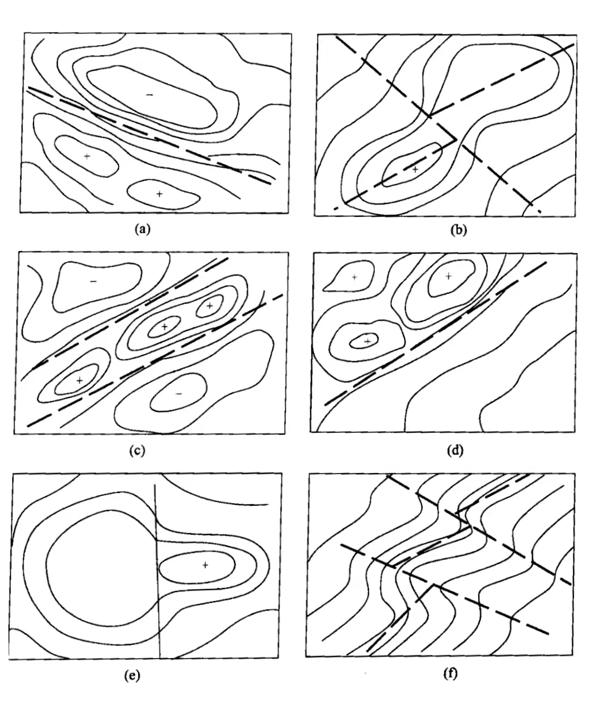

# 重力勘探

## 地球重力场的变化及其影响因素
### 地球重力场的变化 

重力场的变化可以分为不同点位置的空间变化以及同一点的场值随时间的变化    

- 不同点位置的空间变化
    -  一般而言，同一海拔高度下，位于赤道地区重力最小，而处于两极处的重力最大
    -  地表海拔越高，地球重力越小  
- 同一点的场值随时间的变化
      - **长期变化**
          - **原因**: 地壳内部的物质运动，如岩浆活动、构造运动、板块运动等。
         - **特点**: 变化十分缓慢，幅度小，在短时间内变化很弱，故在重力勘探中不予考虑。
       - **短期变化**
          - **原因**: 地球与太阳、月亮之间的相互位置变化引起的。
          - **特点**: 周期短（24小时），变化幅度较大，一般可达 $2-3 \;g.u.$。

### 影响因素
- **空间因素**
  - 地球不是一个正球体，而是近似于两极压缩的椭球体，地表面又是起伏不平的，这将引起 $6.0 \times 10^4 \; g.u.$ 的重力变化。
  - 地球绕一定的轴旋转，这将引起 $3.4 \times 10^4\; g.u.$ 的重力变化。
  - 地下物质密度分布不均一将会引起几千 $g.u.$ 的重力变化（重力勘探正是利用地下物质密度分布不均一这一因素产生的重力变化来研究地质构造以达到找矿勘探的目的）。
- **时间因素**
  - 太阳、月亮等天体引力产生的重力变化，表现为一定的周期性，也称为潮汐，大小可达 $3 \; g.u.$。
  - 地球形状的变化和地下物质运动产生的变化一般是非周期的，大小不超过 $1\;g.u.$。

---

## 重力基点网联测方法及作用
### 基点网观测方法
- 基点网观测方法的选择，以能对观测数据进行可靠的零点偏移校正，满足设计提出的精度要求为原则。
- 当重力仪零点漂移较小又近于线性时，可采用单向循环重复或往返重复方法；否则，应采取多台仪器多次重复观测。
- **常用方法**: 三重小循环观测。

### 观测顺序
- **单向循环重复顺序**: $1 \to 2 \to 3 \to … \to 1 \to 2 \to 3$
- **往返重复方法顺序**: $1 \to 2 \to 3 \to … \to 3 \to 2 \to 1$
- **多台仪器重复观测顺序**: $1 \to 2 \to 1 \to 2 \to 3 \to 2 \to 3 \to 4 \to 3 \to 4 \to …$

### 作用
- 控制重力普通点的观测精度。
- 避免误差积累。
- 检查重力仪在某一段工作时间内的零点漂移。
- 确定零点漂移校正系数。
- 推算全区重力测点上的绝对重力值和相对重力值。

---

## 重力异常的地质与地球物理意义及计算方法
### 重力异常分类
- **自由空间重力异常**
  - 仅做正常场校正和高度校正后得到的异常。
  - **意义**: 反映实际地球的形状与质量分布与大地椭球体的偏差。
  - **特点**: 
    - 负的自由空间重力异常表明地壳深部存在相对的质量亏损。
    - 正的自由空间重力异常表明地壳深部存在质量盈余。
- **布格重力异常**
  - 对观测值做地形校正、正常场校正和布格校正后得到。
  - **意义**: 
    - 反映壳内各种偏离正常密度分布的矿体与构造的影响。
    - 包括地壳下界面起伏在横向上的相对质量亏损或盈余。
  - **特点**:
    - 陆地（尤其山区）: 大范围的负值区，山越高，异常越负。
    - 海洋: 大范围的正值区。
  - **类型**:
    - **绝对布格重力异常**: 
      - 以大地水准面为基准面，观测值为绝对重力值。
      - 布格校正高度为海拔，密度统一为 $2.67 g/\text{cm}^3$。
      - 正常场校正按正常重力公式计算。
      - 多用在中小比例尺的测量中，以便大面积的拼图和统一进行解释
    - **相对布格重力异常**: 
      - 相对于局部基准面计算，观测值为相对重力值。
      - 布格校正高度为测点相对总基点的相对高程，密度用当地地表实测的平均密度值。
      - 正常场校正按小面积纬度校正公式计算
      - 多用在小面积大比例尺的测量中，以便于对局部的异常做较深入的分析
- **均衡重力异常**
  - 布格重力异常经过均衡校正后得到。均衡改正是将移去的大地水准面以上的全部地形质量填充到山根或者反山根中
  - 地壳均衡状态：均衡重力异常接近于零。
  - 正均衡状态：存在质量盈余，山高而山根又不够厚，又称补偿不足。
  - 负均衡状态：存在质量亏损，山高而山根太厚，又称补偿过剩。
  - 非均衡状态：**地壳**会不断进行质量调整，逐步达到均衡状态。
### 重力异常计算方法
地形校正、中间层校正、高度校正、正常场校正（纬度校正）

- 地形校正：消除地形起伏对测点重力异常的影响，即高于测点的地形产生的重力异常消去，低于测点的地形产生的重力异常补偿。
- 中间层校正：经过地形校正，测点附近的地形变为水准面，但是测点所在的平面与大地水准面之间还存在一个水平物质层，消除这一物质层所产生的影响就是中间层校正  
$\Delta g_{中} = 0.419 \rho h$  
$\rho$ 一般取  $2.67 \; g/cm^3$，$h$的单位为$m$ 测点高于总基点时，$h$取正
- 高度校正：经过地形校正和中间层校正后，测点所在的平面与大地水准面之间还存在一个高度差，消除这一高度差所产生的影响就是高度校正  
$\Delta g_h = 3.086 \cdot h \;\;(g.u.)$   
$h$的单位为$m$ 测点高于总基点时，$h$取正

- 正常场校正：由于测点和总基点不在同一纬度上，因此其正常重力值也不同，消除测点随纬度的变化而产生的正常重力变化就叫做正常场校正。  
$\Delta g_{\varphi} = - 8.14 sin 2 \varphi D\;\; (g.u.)$    
$D$ 的单位是 $km$ ，是测点与总基点之间的纬度距离，在北半球，测点位于总基点以北 $D$ 取正。

---

## 重力异常识别及地质解译
分为5种:等轴状重力高,等轴状重力低,条带状重力高,条带状重力低,重力梯级带

- 等轴状重力高:  
  - 基本特征: 重力异常等值线圈闭成圆形或接近圆形，异常值中部分高,四周低，有极大值点。
  -相对应的规则几何形体: 剩余密度为正值的均匀球体，铅直圆柱体，水平截面接近正多边形的铅直棱柱体，
  - 可能反映的地质因素:囊状,巢状,透镜状的致密金属矿体;中基性岩浆、（密度较高）的侵入体，侵入在密度较低的地层中；短轴背斜，低密度岩层形成的向斜，松散沉积物下面的基岩局部隆起。
- 等轴状重力低
  - 基本特征: 重力异常等值线圈闭成圆形或接近圆形，异常值中部分低,四周高，有极小值点
  - 相对应的规则几何形状: 剩余密度为负值的均匀球体,铅直圆柱体,水平截面接近正多边形的铅直棱柱体。
  -可能反映的地质因素: 盐丘构造或盐盆地中盐层加厚的地段，酸性岩浆（密度较低）的侵入体，侵入在密度较高的岩层中。高密度盐层形成的短轴向斜，古老岩系中存在巨大的溶洞，新生界松散沉积物的局部加厚地段。
- 条带状重力高
  - 基本特征：重力异常等值线延伸很大或闭合成条带状，等值线的值中心高，两侧低，存在极大值线。  

  - 相对应的规则几何形体：剩余密度为正的水平圆柱体、棱柱体和脉状体等。  

  - 可能反映的地质因素：高密度岩性带或金属矿带；中基性侵人岩形成的岩墙或岩脉穿插在较低密度的岩石或地层中；高密度岩层形成的长轴背斜、长垣、地下的古潜山带、地垒等；地下的古河道为高密度的砾石所充填等。  

- 条带状重力低
  - 基本特征：重力异常等值线延伸很大，或闭合成条带状，等值线的值中心低，两侧高，存在极小值线。  

  - 相对应的规则几何形体：剩余密度为负的水平圆柱体，棱柱体和脉状体等。  

  - 可能反映的地质因素：低密度的岩性带，或非金属矿带；酸性侵入体形成的岩墙或岩脉穿插在较高密度的岩石或地层中；高密度岩层形成的长轴向斜、地堑等；充填新生界松散沉积物的地下河床。  

- 重力梯级带  

    - 基本特征：重力异常等值线分布密集，异常值向某个方向单调上升或下降。相对应的规则几何形体：垂直或倾斜台阶。  

    - 可能反映的地质因素：垂直或倾斜断层、断裂带、破碎带；具有不同密度的岩体的陡直接触带；地层的坳曲。  

断裂构造识别的标志    

+  线性重力高与重力低之间的过渡带；
+  异常轴线明显错动的部位；
+ 串珠状异常的两侧或轴部所在位置；
+ 两侧异常特征明显不同的分界线；
+ 封闭异常等值线突然变宽、变窄的部位；
+ 等值线同形扭曲部位

---
